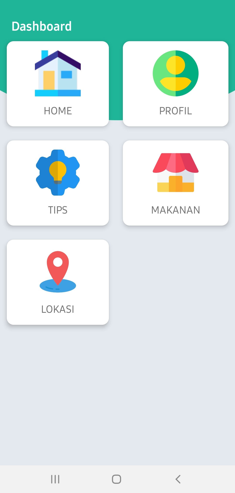

## AplikasiKu

Aplikasi android yang berfungsi untuk melihat berbagai tips makanan dan mendata makanan beserta harganya

# Technology Used
1. Java
2. Android Studio
3. SQLite
4. LocalAPI
5. Recycler View
6. MapsAPI
7. Location Based service
8. Scroll View

## Preview Android

